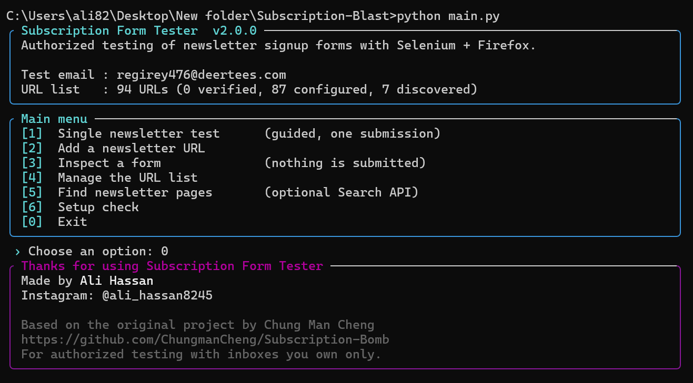

# Subscription Form Tester

A beginner-friendly Python command-line tool that uses **Selenium and Mozilla Firefox** to inspect newsletter signup forms and run **one controlled test subscription** with an email address that **you own**.

It has a clean boxed, colourful terminal interface - but it is still a simple CLI, not a desktop app.

> **Authorized use only.** Use this tool only with inboxes and services you own or are explicitly allowed to test. It deliberately contains no bulk mode, no multi-address mode and no CAPTCHA / rate-limit / bot-protection bypassing. See [License and intended use](#license-and-intended-use).

---

## 1. Features

- **Guided single test** - pick one URL, inspect its form, submit it **once** with your own `TEST_EMAIL`, and get a clear result.
- **Automatic form detection** - finds the email field and submit button, including forms inside iframes and JavaScript-rendered forms, and ticks required consent checkboxes in the same form.
- **Manual fallback** - when detection is unsure, choose fields from a numbered table or type a CSS selector.
- **Honest status for every URL** - `discovered`, `configured`, `verified`, `failed`, `unavailable`. A URL is never marked working unless a test actually succeeded.
- **Friendly errors** - missing Firefox, bad paths, bad API keys, blocked pages and timeouts all get a plain-English message and a hint instead of a traceback.
- **Optional Search API** (Tavily-compatible) to find *candidate* newsletter pages for you to review.
- **Optional IMAP** to watch *your own* mailbox for the confirmation email.
- **Safety by design** - one address, one submission, and a per-URL cooldown (default 30 minutes) so no site is ever hit repeatedly.
- **Tests** - 60+ fast tests that need no browser and no network.

## 2. Requirements

| Needed | Notes |
|---|---|
| Windows 10/11 (also works on macOS/Linux) | Instructions below are for Windows PowerShell |
| Python 3.10 or newer | https://www.python.org/downloads/ - tick **Add python.exe to PATH** |
| **Mozilla Firefox** | **Required.** https://www.mozilla.org/firefox/ |
| Internet connection | Needed the first time so Selenium can download geckodriver |

## 3. Mozilla Firefox requirement

**The tool only works with Mozilla Firefox.** Chrome and Edge are not used.

- You do **not** need to install geckodriver by hand. Selenium Manager (built into Selenium 4) downloads it automatically on first run.
- Firefox is auto-detected from the usual Windows locations (`C:\Program Files\Mozilla Firefox\firefox.exe`, `Program Files (x86)`, the registry and `PATH`).
- If Firefox lives somewhere else, set `FIREFOX_PATH` in `.env` (see below).
- If Firefox is missing you will see a message like *"Mozilla Firefox could not be found"* with the download link - not a traceback.

## 4. Windows setup (step by step)

Open **PowerShell** in the project folder (in File Explorer: open the folder, click the address bar, type `powershell`, press Enter).

```powershell
# 1. Check Python (should print 3.10 or higher)
python --version

# 2. Create a virtual environment (an isolated place for this project's packages)
python -m venv .venv

# 3. Activate it - your prompt now starts with (.venv)
.\.venv\Scripts\Activate.ps1

# 4. Install the dependencies
pip install -r requirements.txt

# 5. Create your configuration file
Copy-Item .env.example .env
notepad .env
```

If step 3 says *"running scripts is disabled"*, run this once and try again:

```powershell
Set-ExecutionPolicy -Scope CurrentUser RemoteSigned
```

Next time you only need steps 3 and `python main.py`.

## 5. `.env` configuration

`.env.example` documents every setting. Only **`TEST_EMAIL`** is required.

```dotenv
TEST_EMAIL=you@example.com          # ONE address you own (required)
FIREFOX_PATH=                       # optional, full path to firefox.exe
HEADLESS=false                      # true = no visible browser window
PAGE_WAIT=8                         # seconds to wait for a page/form
URL_JSON=email_subscription.json    # where your URL list is stored
TEST_COOLDOWN_MINUTES=30            # min. wait before the same URL is tested again

SEARCH_API_URL=https://api.tavily.com/search   # optional
SEARCH_API_KEY=                                # optional
SEARCH_MAX_RESULTS=10

IMAP_HOST=                          # optional
IMAP_PORT=993
IMAP_USER=
IMAP_PASSWORD=
IMAP_FOLDER=INBOX
IMAP_TIMEOUT=90
```

Good to know:

- `.env` is listed in `.gitignore`. **Never commit or share it** - it can contain your API key and mailbox password. No secret is stored anywhere in the code.
- If `TEST_EMAIL` is missing or is not exactly one valid address, the test refuses to run and tells you what to fix.
- Bad numbers (for example `PAGE_WAIT=soon`) produce a clear message naming the setting.

## 6. Starting the application

```powershell
.\.venv\Scripts\Activate.ps1
python main.py
```

You should see the banner and the main menu:



## 7. The menu, option by option

| Option | What it does |
|---|---|
| **1 - Single newsletter test** | The guided workflow described in [section 8](#8-safe-single-newsletter-testing-workflow). The only option that submits a form. |
| **2 - Add a newsletter URL** | Validates the URL, checks that it responds, saves it as `discovered`, and optionally inspects its form right away. |
| **3 - Inspect a form** | Opens Firefox, finds the form and saves the selectors. **Never types or submits anything.** If nothing is detected you can pick fields manually. |
| **4 - Manage the URL list** | **v** view details, **c** check availability (one plain HTTP request per URL, 1 s apart), **s** change a status by hand, **d** delete an entry. |
| **5 - Find newsletter pages** | Optional. Asks the Search API for candidates; you choose which to add (as `discovered`). Needs `SEARCH_API_KEY`. |
| **6 - Setup check** | Shows whether `TEST_EMAIL`, Firefox, the URL file, Search API and IMAP are ready, and can test the IMAP login. |
| **0 - Exit** | Shows the credits screen. `Ctrl+C` at any prompt cancels the current action safely. |

### URL statuses

| Status | Meaning |
|---|---|
| `discovered` | URL known; form not inspected yet. |
| `configured` | Email/submit selectors saved, but not proven by a successful test + received email. |
| `verified` | A test ran **and** the email was confirmed (found over IMAP, or you confirmed it). |
| `failed` | The last inspection or test failed (selector not found, rejected, timeout...). |
| `unavailable` | Page gone, blocked by bot protection, or redirected to a login. |

## 8. Safe single-newsletter testing workflow

Choose **1** in the menu. The tool walks through six steps:

1. **Test email** - reads `TEST_EMAIL` and asks you to confirm you own it.
2. **Choose a page** - pick one saved URL or type a new one.
3. **Inspect the form** - Firefox opens the page; the tool shows the detected email field, submit button and any consent checkbox (and warns if a CAPTCHA is present).
4. **Confirm** - a yellow box shows the address and page; you must answer *yes* to submit.
5. **Run the test** - the address is typed and the form is submitted **exactly once**. The result is classified as:
   - `confirmed_on_page` - the site showed a thank-you / confirmation message
   - `submitted` - the click worked but the page gave no clear signal
   - `already_subscribed`, `rejected`, `blocked`, `not_found` (selector missing), `timeout`, `error`
6. **Check the email** - with IMAP the tool watches your mailbox; otherwise open your inbox (and spam/promotions) yourself, then answer *did it arrive?*. Only then is the URL marked `verified`.

Everything is logged to `logs/subscription_tester.log`; failed tests also save a screenshot in `logs/`. A URL that was just tested is locked for `TEST_COOLDOWN_MINUTES`.

## 9. Search API configuration (optional)

Only needed for menu option 5. Any **Tavily-compatible** endpoint works.

1. Create a key at https://tavily.com (keys look like `tvly-...`).
2. Put it in `.env`: `SEARCH_API_KEY=tvly-your-key` (no quotes, no spaces).
3. Leave `SEARCH_API_URL` at its default unless your provider says otherwise.

The Search API only suggests URLs; it never opens or submits anything.

If the key is wrong you will see **one** clear message, for example: *"The Search API rejected your API key (HTTP 401)... Check SEARCH_API_KEY in .env"* - the tool does not retry or repeat it.

## 10. IMAP configuration (optional)

IMAP lets the tool detect the confirmation/welcome email automatically. Without it everything else still works.

```dotenv
IMAP_HOST=imap.gmail.com
IMAP_PORT=993
IMAP_USER=you@gmail.com
IMAP_PASSWORD=your-app-password
IMAP_FOLDER=INBOX
```

- Gmail, Outlook and Yahoo require an **app password** (a normal password is rejected - the error message says so). Gmail also needs IMAP enabled in its settings.
- Gmail users: set `IMAP_FOLDER="[Gmail]/All Mail"` if the email lands in Promotions or Spam.
- The tool opens the mailbox **read-only**, takes a snapshot *before* the test (old mail is ignored) and never prints the password.
- Use **Setup check -> test the IMAP login** to validate your settings.

## 11. Troubleshooting

| Problem | Fix |
|---|---|
| *"Mozilla Firefox could not be found"* | Install Firefox, or set `FIREFOX_PATH=C:\Program Files\Mozilla Firefox\firefox.exe`. |
| *"FIREFOX_PATH points to a file that does not exist"* | Correct the path (no quotes needed) or delete the line to auto-detect. |
| *"Could not set up geckodriver"* | You need internet on the first run; check proxy/firewall. |
| *"Firefox ... could not be started"* | Close stuck `firefox.exe` / `geckodriver.exe` in Task Manager; update Firefox. |
| *"TEST_EMAIL is not set"* | Copy `.env.example` to `.env` and set it. |
| `Activate.ps1` is blocked | `Set-ExecutionPolicy -Scope CurrentUser RemoteSigned` |
| *"The Search API rejected your API key (HTTP 401)"* | Check `SEARCH_API_KEY` and that the key is active. |
| *"The mail server rejected the IMAP login"* | Use an app password; check `IMAP_USER`. |
| Status `unavailable` / outcome `blocked` | The site uses bot protection or a CAPTCHA. The tool does not bypass it - test that page by hand. |
| *"No newsletter form could be detected"* | Choose **manual selection**, or open the suggested link the tool prints. |
| Outcome `not_found` | The page layout changed - re-run **Inspect a form** for that URL. |
| *"This URL was tested recently"* | Cooldown protecting the site; wait or lower `TEST_COOLDOWN_MINUTES` (minimum 10). |
| Nothing arrived in the inbox | Check spam/promotions; many sites need you to click a confirmation link (double opt-in). |

Unexpected bugs are written to `logs/subscription_tester.log` - attach it when reporting an issue.

**Limitations:** forms inside *nested* iframes or Shadow DOM, multi-step wizards and forms protected by CAPTCHA cannot be handled automatically; use manual selection or test those pages by hand.

## 12. Project structure

```
Subscription-Bomb/
├── main.py                  # entry point + main menu
├── modes.py                 # menu workflows (single test, add, inspect, manage, search, setup check)
├── browser.py               # Firefox start-up, form inspection, the single test submission
├── config.py                # .env loading and validation (Settings dataclass), credits constants
├── storage.py               # JSON database: statuses, migration, de-duplication, cooldown
├── selector_utils.py        # saved-field -> CSS selector, selector text parsing
├── url_utils.py             # URL validation / normalisation, availability check
├── search_api.py            # optional Tavily-compatible discovery
├── imap_utils.py            # optional mailbox check
├── ui.py                    # boxes, colours, symbols, spinner, tables
├── errors.py                # friendly error types
├── email_subscription.json  # your newsletter URL list
├── .env.example             # configuration template (copy to .env)
├── requirements.txt         # runtime dependencies
├── requirements-dev.txt     # + pytest
├── test_main.py             # tests (no browser, no network)
├── LICENSE
├── README.md
└── screenshots/
```

Run the tests:

```powershell
pip install -r requirements-dev.txt
python -m pytest -q
```

## 13. About the URL list

`email_subscription.json` was cleaned in this version: duplicates, tracking-parameter variants, blog posts / how-to articles, account pages and a private third-party list were removed (147 -> 94 entries), and seven public newsletter pages were added after their content was retrieved and checked.

- **Nothing is marked `verified`.** Pages carried over from the old file are `configured` (they have saved selectors, but old results are not trusted); new pages are `discovered`.
- Website forms change often and many sites block automated requests, so some entries will inevitably be outdated. Use **Manage the list -> c** to re-check availability and **Inspect a form** to refresh selectors. Entries that fail move to `failed` or `unavailable` instead of staying "working".
- The old `"verified": true/false` format is migrated automatically on first load.

## 14. Configuration examples

Minimal (visible browser, no extras):

```dotenv
TEST_EMAIL=me@example.com
```

Firefox in a custom folder, headless:

```dotenv
TEST_EMAIL=me@example.com
FIREFOX_PATH=D:\Apps\Firefox\firefox.exe
HEADLESS=true
```

Everything on (Gmail + Tavily):

```dotenv
TEST_EMAIL=me@gmail.com
SEARCH_API_KEY=tvly-xxxxxxxx
IMAP_HOST=imap.gmail.com
IMAP_USER=me@gmail.com
IMAP_PASSWORD=your-16-char-app-password
IMAP_FOLDER=[Gmail]/All Mail
```

## 15. Screenshots

The main menu is shown above. Screenshots of the form-inspection and result screens are not included because they depend on a live browser session on your machine; after your first real run you can save your own into `screenshots/` (for example `inspect.png`, `result.png`) and link them here.

## 16. Credits

**Made by Ali Hassan**
Instagram: [@ali_hassan8245](https://instagram.com/ali_hassan8245)

This project is a refactor of the original **Subscription-Bomb** by Chung Man Cheng - https://github.com/ChungmanCheng/Subscription-Bomb. Thanks to the original author for the foundation. The same credits appear on the CLI exit screen.

## 17. License and intended use

Released under the **MIT License** - see [LICENSE](LICENSE). The copyright notice credits both this refactor and the original authors; if you publish this repository, please confirm that the original project's license/permission allows redistribution.

**Intended use:** learning browser automation and testing newsletter forms with addresses and services you own or are authorized to test. It must not be used to send unsolicited subscriptions, flood inboxes, or bypass CAPTCHAs, rate limits or other protections. You are responsible for following the law and each site's terms of service.
